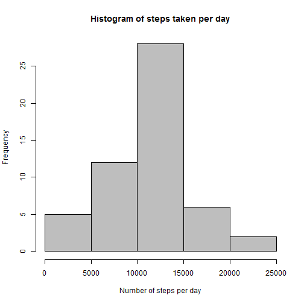
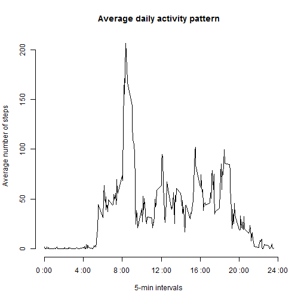
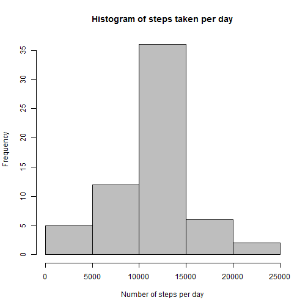
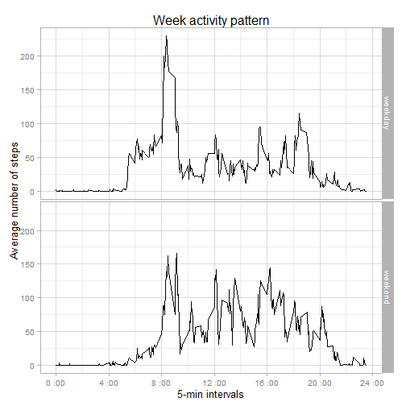

# Reproducible Research: Peer Assessment 1  

This assigment makes use of data from a personal activity monitoring device that collects data at 5 minute intervals through out the day. The data consists of two months of data from an anonymous individual collected during the months of October and November, 2012.  

Dataset can be downloaded from [here](https://d396qusza40orc.cloudfront.net/repdata%2Fdata%2Factivity.zip)  

The variables included in this dataset are:
- **steps**: Number of steps taking in a 5-minute interval (missing values are coded as *NA*)  
- **date**: The date on which the measurement was taken in YYYY-MM-DD format  
- **interval**: Identifier for the 5-minute interval in which measurement was taken  

To make sure that all code chunks are visible, we use:

```r
opts_chunk$set(echo=TRUE)
```

## Loading and preprocessing the data  
The data file **activity.csv** is extracted from the compressed file downloaded and then loaded into the data frame *rawData*. Next, we extract only complete cases into data frame *data*.  


```r
rawData <- read.csv("activity.csv", header=T, sep=",")
data <- na.omit(rawData)
summary(data)
```

```
##      steps                date          interval     
##  Min.   :  0.00   2012-10-02:  288   Min.   :   0.0  
##  1st Qu.:  0.00   2012-10-03:  288   1st Qu.: 588.8  
##  Median :  0.00   2012-10-04:  288   Median :1177.5  
##  Mean   : 37.38   2012-10-05:  288   Mean   :1177.5  
##  3rd Qu.: 12.00   2012-10-06:  288   3rd Qu.:1766.2  
##  Max.   :806.00   2012-10-07:  288   Max.   :2355.0  
##                   (Other)   :13536
```
    
## What is mean total number of steps taken per day?  
Total steps are summed up grouped by date and displayed as a histogram.  
Mean and median are calculated right after.


```r
library(dplyr)
steps_day <- summarise(group_by(data, date), steps=sum(steps))
hist(steps_day$steps, col="grey", xlab="Number of steps per day", 
     ylab="Frequency", main = "Histogram of steps taken per day")
```

 

```r
sprintf("Mean: %.0f", mean(steps_day$steps))
```

```
## [1] "Mean: 10766"
```

```r
sprintf("Median: %.0f", median(steps_day$steps))
```

```
## [1] "Median: 10765"
```
We can see that the mean and the median are very close together, which means that variable distribution is almost symmetrical.

## What is the average daily activity pattern?
Average steps are calculated across all 5-minute intervals and displayed as a time series plot. X-axis has been modified to show the time in a 24h format instead of the 5-minute intervals.


```r
steps_int <- summarise(group_by(data, interval), mean_steps=mean(steps))
plot(steps_int$interval/100, steps_int$mean_steps, type="l", 
     xlab="5-min intervals", ylab="Average number of steps", axes=FALSE,
     main="Average daily activity pattern")
axis(2)
axis(1, at=seq(0, 24, by=4), labels=paste(seq(0, 24, by=4), ":00"))
```

 

The maximum number of steps is

```r
row <- filter(steps_int, mean_steps==max(steps_int$mean_steps))
sprintf("%0.1f", row$mean_steps)
```

```
## [1] "206.2"
```

which ocurrs in the interval starting at

```r
sprintf("%d:%02d", floor(row$interval/100),row$interval%%100)
```

```
## [1] "8:35"
```

## Imputing missing values

There are some missing values (coded as NA) in the original dataset, 2304 to be exact. This represents over 4% of the total of our data. Although this number is not very high it might introduce bias into some calculations or summaries.

```r
nas <-sum(is.na(rawData))
sprintf("NA's are %0.2f%% of the values", nas*100/(nrow(rawData)*ncol(rawData)))
```

```
## [1] "NA's are 4.37% of the values"
```

Now, we'll design an strategy for filling this missing values with some data in order to compare whether exists big differences between the original data and the imputed one.  

We'll create a new dataset equal to the original one but with the missing data filled with the mean of that 5-minute interval.  


```r
newData <- mutate(rawData, steps=ifelse(is.na(steps), 
                                           steps_int$mean_steps, steps))
summary(newData)
```

```
##      steps                date          interval     
##  Min.   :  0.00   2012-10-01:  288   Min.   :   0.0  
##  1st Qu.:  0.00   2012-10-02:  288   1st Qu.: 588.8  
##  Median :  0.00   2012-10-03:  288   Median :1177.5  
##  Mean   : 37.38   2012-10-04:  288   Mean   :1177.5  
##  3rd Qu.: 27.00   2012-10-05:  288   3rd Qu.:1766.2  
##  Max.   :806.00   2012-10-06:  288   Max.   :2355.0  
##                   (Other)   :15840
```

Let's go to make a histogram of the total number of steps taken each day and report the mean and median to make a comparison.

```r
steps_day <- summarise(group_by(newData, date), steps=sum(steps))
hist(steps_day$steps, col="grey", xlab="Number of steps per day", 
     ylab="Frequency", main = "Histogram of steps taken per day")
```

 

```r
sprintf("Mean: %.0f", mean(steps_day$steps))
```

```
## [1] "Mean: 10766"
```

```r
sprintf("Median: %.0f", median(steps_day$steps))
```

```
## [1] "Median: 10766"
```

After the imputation process, we can see that the mean and median of the number of steps per day are the same value. Mean remain in 10766 steps and median has changed very slightly. Therefore, we can conclude that our process of imputing missing values with the mean of the 5-minute interval has no effect in our calculations. We must keep in mind that we have done all the calculations with complete cases, we omitted all the NA rows at the beginning! Perhaps, if we had kept the original dataset, results would have been a little different.

## Are there differences in activity patterns between weekdays and weekends?
For this part, we make use of the imputed dataset generated before. A new variablet that distinguish between weekdays and weekends has been added to our data to make plots of the average number of steps taken.

```r
library(ggplot2)
weekData <-mutate(newData, weekend=ifelse(weekdays(as.Date(date)) %in% 
                  c("sábado","domingo"), "weekend", "weekday"))
steps_int <- summarise(group_by(weekData, interval, weekend), mean_steps=mean(steps))
g <- ggplot(steps_int, aes(x=interval/100, y=mean_steps)) + 
      geom_line() + facet_grid(weekend ~ .)  + theme_light(base_size=13) +
      scale_x_continuous(breaks=seq(0,24,by=4), 
                         labels=paste(seq(0,24,by=4), ":00"))+
      labs(x="5-min intervals", y="Average number of steps",
           title = "Week activity pattern")
print(g)
```

 

Overall, we can see that more levels of activity take place during the weekends and activity tends to start later.
